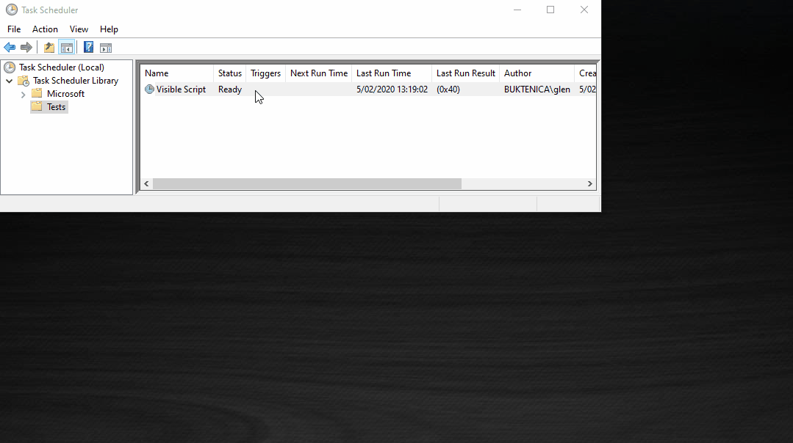
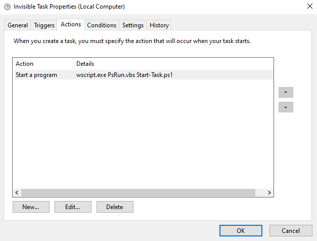

# PsRun

[](https://opensource.org/licenses/MIT)
[](http://buktenica.com)
[](https://github.com/PowerShell/PowerShell/releases)
[](https://github.com/PowerShell/PowerShell/releases)
[](https://github.com/PowerShell/PowerShell/releases)  
Running PowerShell scripts in a user context without any window being displayed at all is not possible just using PowerShell.  
The closest way is the WindowStyle hidden switch available from PowerShell version 2 onwards:

```powershell
# PowerShell 2 to 5.1
powershell.exe -WindowStyle hidden -File Run-Script.ps1
```

```powershell
# PowerShell 6 to 7
pwsh.exe -WindowStyle hidden -File Run-Script.ps1
```

This will still display a temporary PowerShell window.  



To completely remove the window from the use context use this vbs to call the PowerShell script:

```command
wscript.exe PsRun.vbs Run-Script.ps1
```

The most common use case for this operation is a scheduled task that needs to run in the user context and needs to not display an annoying pop-up.


